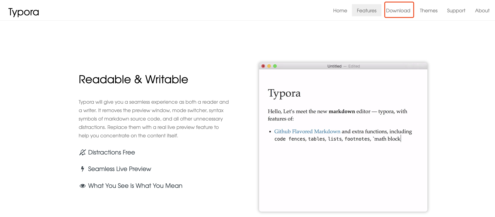
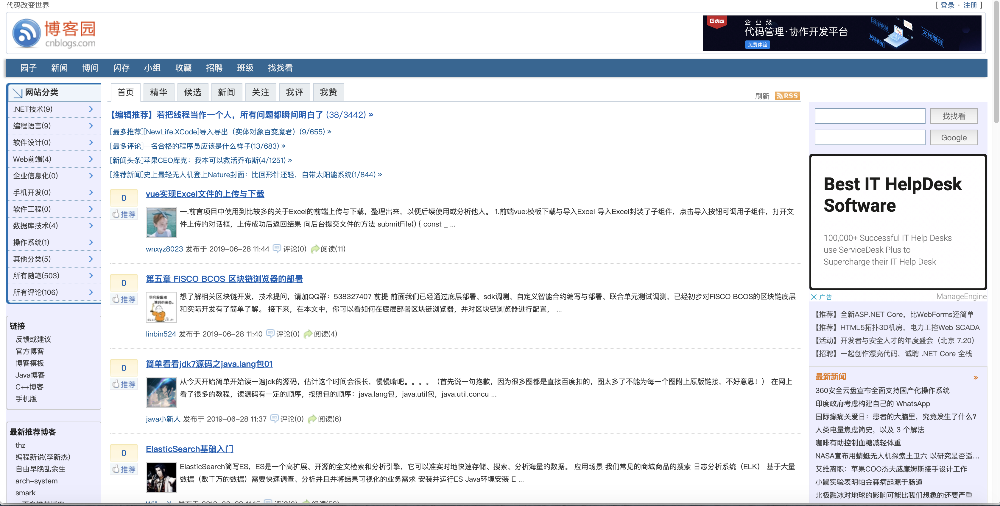

## 一.Typora安装

今天我们先不讲解Python的知识，我们先用三天的时间讲解一下程序员必备的软件和使用。

我们在之前的时候记录笔记就是使用word和记事本，但是从今天开始我们要更换软件，记录笔记使用Typora软件，为什么要使用Typora的软件呢,是因为我们程序员不只是写代码这一件事,我们还需要写README文档,这个文档是说明你的程序如何使用的,README编写使用的是Markdown语法,有人就有疑问Markdown和Typora软件有什么关系吗? 

**Typora这个软件就是使用Markdown进行编辑的,并且这个软件比较小**

我们要从现在开始习惯使用Markdown所以要求你们以后记录笔记的时候使用Typora软件,现在我们就先对这个软件进行安装.

点击右侧链接 https://typora.io/ 进行下载

找到页面中的 `Download` 进行下载，如下图：


点击下边的箭头，效果如下图：



找到图中的 `Download` 点击,效果图如下：


Windows系统安装:


针对自己电脑的位数进行安装,现在大部分的电脑都是64位的,我的是64位我选择64位进行下载


这是下载的安装程序,我们现在双击这个图标


 选中的是要安装的路径,建议修改成**C:\Typora**然后选择Next


`Create a desktop shortcut` 这个是在桌面上创建一个快捷图标,选择图中箭头所值的位置进行安装


下图是安装中:


当出现下图的就表示安装成功了,我们只需要点击一下箭头所指的位置就可以了


苹果系统安装:


苹果电脑直接选择这个就开始下载安装包


找到安装的程序进行双击,双击后的效果如下图:


软件就安装成功了,现在打开我们安装的软件,我带着大家把咱们以后记笔记的样式写一下.

在电脑的C盘或则D盘创建一个文件夹 — 然后文件夹的名字叫做 Python学习笔记我们进入Python学习笔记中然后创建一个文件 Python学习手册 都创建好后就记住我们以后的笔记全部都存放在这个Python学习手册中,怎么编写笔记呢? 我们来学习一下Markdown的使用

## 二.Markdown语法

''' # 一级标题 '''

''' ## 二级标题 '''

''' ### 三级标题 '''

''' #### 四级标题 '''

''' ##### 五级标题 '''

''' **文字加粗**  '''

''' *你好*  斜体 '''

''' 转义 \''' 

标题这个部分我们一般都是用到五级标题,有的时候我们需要列一些内容,就需要使用到序号,我们看看序号怎么使用

''' 1.+ Tab键 ''' 这样就是一个有序序号,当编辑完这一行的时候换行后序号自动增加

刚刚我们说的是有序的序号,现在来看看无序的序号

''' - + Tab键 ''' 这样就是一个无序序号

如果我们想要在某一行的下面继续写内容,如图:


就按下键盘的Tab键,然后继续编辑,说我编辑完了,想要回到第一章同级的位置找到键盘的Tab和Shift键同时按下,或者多按几次回车

我们是程序员,记录的笔记中不可能全是文字,一定会有代码,代码直接粘贴到这里不易查看,我们学习一下怎么存放代码

''' ```python ''' 然后回车的时候就出现一下的内容

```python
存放代码块
```

我们直接在里边写代码就行了

现在我们知道了怎么编写文字,怎么编写代码,但是这两个完全不能满足我们的需求啊,我想弄个图片怎么办啊,很是简单图片我们直接粘贴过来就行了,但是有个需要注意的地方,我们设置一下图片都存在哪个地方,这样方便我们查找.

设置完图片的存放位置,我们有时候需要写一个表格来记录一些内容, …….

Typora这个软件的强大之处不仅仅能够写内容还可以导出pdf,word等格式

这个软件我们就学习完毕了, 以后我们课程的笔记都必须使用这个软件来记录

我们刚刚创建了Python学习笔记这个文件夹和Python学习手册的文件,我们现在对

Python学习手册的这个文件添加一些内容.

```python
第一章 环境搭建
第二章 入门
第三章 基础
第四章 函数
第五章 模块
第六章 面向对象
第七章 网编
第八章 数据库
第九章 前端
第十章 Django
```

我们现在把这些框架列出来,你们以后预习的笔记和上课的笔记都可以写在里边,等你们毕业的时候就相当于写了一本书,查看的时候也好查看.

## 三.博客园使用

我们讲解完本地的笔记怎么编写,我们现在讲解一下线上的笔记怎么记录,有人肯定会有疑问 不是都说了本地的编写了吗?怎么还要写线上的笔记啊,要知道我们都是技术人员,搞技术的人员都是要有一个技术博客,并且在后期面试的时候有的公司会查看我们的技术博客,这个大家一定要有

我现在带领大家来开通一下 点击 http://cnblogs.com 内容如下图:



找到右上角的注册,接下来的页面如下图:


然后注册就可以了.剩下的就是登陆,登录后我们来创建一个内容,随笔是对外可见的,文章是自己和你给别人链接才能访问的,我建议你们写成随笔 这样别人就能搜到咱们写的内容. 我们平时只需要写本地的笔记就可以了.博客园的笔记就把我们本地写的markdown文档复制上去就可以查看.

## 四.Notepad++安装

我们在安装一下这个软件,安装这个软件是给咱们写脚本的时候使用,如果用计算机中的记事本创建会有问题,避免你们出现未知的问题,咱们使用Notepad++

Windows系统访问 https://notepad-plus-plus.org/download/v7.7.1.html 这个网站进行下载

然后就下一步下一步进行安装.

苹果电脑就使用终端来创建文件就可以

```python
vim test # 创建一个文件
然后输入内容，输入内容后点击一个esc键 然后输入wq！
```

## 五.今日作业

1. 使用Typora写个学习计划和目标

   计划例如：

   - 7点起床复习一下昨天学习所学习的内容
   - 下午整理笔记 然后写作业 最后预习
   - 晚上12 点前休息

   目标例如：

   - 找一个薪资15000的工作
   - 做一个web后端工程师
   - 工作两年后薪资定位多少

2. 预习Python第一天的课程视频，预习的时候使用Typora做笔记，最后将本地的笔记发布到博客圆中。

   


