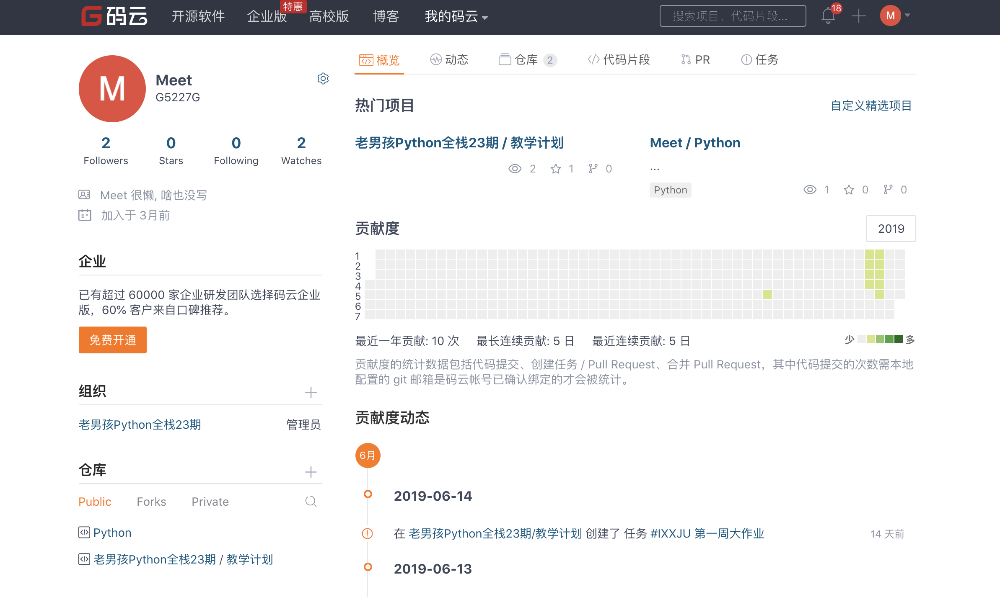

## 一.码云及Git的使用

这个码云和git咱们现在就是简单的讲解,因为在公司中我们开发是协同开发 会频繁使用git,我们从开始就使用不至于上班的时候那么生疏.

现在和大家说说什么是码云?什么又是git?

大家现在都有百度网盘吧,百度网盘是不是就是咱们的一种远程仓库,存放一些小说,音频,片什么的. 我们学习的码云就是一个远程管理的仓库类似于百度网盘. 我们现在想要从百度网盘中上传写内容怎么上传是不是直接点击上传就可以了,下载也是直接点击下载.但是我们现在已经迈入程序员的道路上,我们上传和下载的时候就要用一种装B的方式了,也就是git工具

我们现在使用码云和git干什么呢?? 我每天会把作业上传到码云,你们需要将你们写的作业也上传到码云中,并且还要进行评论.我们每天早上都会查看,你们评论的内容可以写哪道题是不会写,今天学的知识中那些是没有听懂的,我们会针对这些问题给大家进行讲解.你们上传的作业我们会进行查看.

现在我们大家一起访问 https://gitee.com/ 这个地址然后进行注册


有的的就不需要注册了,注册完后我们一定要把账号和密码牢牢的记住



这是登录后的页面,因为我使用过会有内容,你们没有使用过没有内容很正常

然后我们找到右上角的➕


然后选择新建仓库,点击后的效果如下图:


然后进行如下操作:


再三确认没有问题后点击创建


**到了这个页面不要进行任何操作,页面一定不要关闭**

我们现在已经成功的创建了仓库,现在就差将本地的内容通过上传的工具提交的到我们创建的仓库中,我们现在就来安装一个git工具

Windows系统访问 https://gitforwindows.org/ 进行安装

苹果系统 访问 https://sourceforge.net/projects/git-osx-installer/ 进行安装

安装完成后我们开始设置个人信息:

```
git config --global user.name "guobaoyuan"
git config --global user.email "932023756@qq.com"
```

这个只需要设置一次就行了,我们现在在本地创建一个文件夹,例如s24存放就是每天的笔记和作业,大家都创建好后,我们现在开始把本地的仓库和远程的仓库绑定关系

```python
git init
```

这是在本地初始化一个仓库

```python
git add .
```

将s24文件夹下所有的内容添加到马上要上传到远程仓库的地方

```python
git commit -m "first commit"
```

做一个提交记录,当有变化的时候可以进行查看和对比

```python
git remote add origin https://gitee.com/G5227G/20190628001.git
```

本地仓库和远程仓库进行关系绑定

```python
git push -u origin master
```

这是push就是将我们添加的内容从本地上传到远程的服务器,

**此处需要我们输入账号和密码,账号就是注册码云时的邮箱号,密码就是登录码云的密码  此处一定要慎重操作,如果不能确定的就先把码云退出然后在重新登录.**

现在你们都打开自己的仓库看有没有内容.如果有内容的话就说明没有问题了,没有内容的举个手我看一下 大家远程仓库中都有内容后,

我和大家强调几个东西:

- 不能在远程仓库中进行操作,要进行操作你能在咱们本地的仓库,最后在更新到远程仓库

- 不能上传视频等文件,不然会非常的麻烦不好搞定

- 刚刚我们输了不少的命令,你们以后在s_24这个文件中向远程的仓库上传内容的时候只需要输入这四条命令就行了

  ```python
  git add .
  git commit -m "fisrt commit" # frist commit是一个描述
  git remote add origin https://gitee.com/G5227G/20190628001.git
  git push -u origin master
  ```

现在大家都创建好自己的仓库,仓库中也有内容后,你们点击下面的链接.

https://gitee.com/organizations/laonanhaipythonquanzhan24qi/invite?invite=fc911cbc286616bd1fae0a3397dbfa02b8fdf60005169706fa1a78571b3930f7d6631b079b611080383038e943f171de 添加组织,你们每个人必须都要进来,不然你就找不到组织了.

你们每天睡觉前的任务就是有没有提交作业,有没有提交评论,提交了以后才能安睡觉

