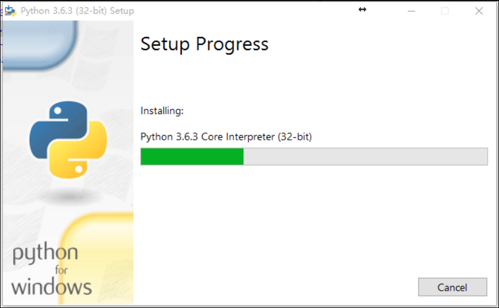
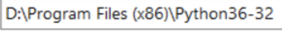

## 一.Python环境安装

你们有没有人来的时候刚买的电脑，打比方我们要去中关村买一个电脑，卖电脑的小哥就会问你要什么配置的电脑啊，小哥说的配置是什么呢？

配置就是图中的cpu，主板，内存，硬盘等等，我们有一部分人是小白对这个不是太明白的，我们就简单的说一下计算机的基础，后期网编的时候会在进行讲解

cpu相当于我们人类的大脑是进行运算和逻辑处理的

内存是存储临时数据的，我们在word和typora软件中编写的内容就是存储在内存当中 存储在内存中断电就会消失这样数据存储就有问题 需要一个能够永久存储数据的东西

硬盘就是永久存储数据的东西，这个硬盘就是我们常说的C盘D盘 一般存放的都是音频,文本,片儿啥的

固态硬盘也是硬盘就是速度快一些

小哥帮咱们把一台电脑组装好了,现在这个电脑能够运行吗? 不能吧我们只是把硬件都配置好了,我们是不是还需要安装操作系统

我们平时安装的都是win7和win10

我们安装完操作系统后想要社交聊天的是不是需要安装陌陌,微信啥的啊,微信和陌陌叫做应用程序,我们使用应用程序的时候其实就会通过操作系统控制计算机硬件执行的流程.

操作系统也是别人开发一种特殊的软件.下图是计算机硬件和操作系统以及应用程序的关系图:

程序员想要控制机帮助我们工作,计算机要能够听懂程序员的说话,计算机能听懂的话就是程序语言,目前计算机能够听懂的语言共有500多种,咱们只需要会一种就能控制计算机,我们是不需要考虑操作系统怎么调度的硬件,硬件是怎样工作的,我们只需要知道python语言的写法,然后其他的事情就交于python解释器去和计算机沟通,

我们现在就来安装一下python解释器

我们安装python2.7 和 python3.6 我们主要讲解python3.6 因为有些公司使用的python还是2.7 版本我们在后期也会告诉大家2.7和3.6有什么区别.

1.1打开官网：[http://www.python.org](http://www.python.org/)，点击`Downloads`下载,如下图1.2下拉页面，选择对应版本：Python3.6.3，如下图向下查找,找到Python 3.6.3

1.3  根据系统选择对应的安装包,如下图 根据当前系统的选择对用的,红色的是windows32位,绿色的是windows64位

1.4下载完成，如下图下载完成后找到下载的目录,然后用鼠标左键双击

1.5 安装

1.6 执行下一步1.7 勾选安装1.8 安装进度1.9 安装成功1.10 验证是否配置成功打开电脑的终端(黑窗口),输入 python回车进去python解释器,返回的结果入下图:

1.11 如果不能成功的运行到上图的内容,我们需要找到自己的计算机,然后右键属性,如下图:

1.12 点击上图的高级系统设置,然后出现以下图片:

1.13 点击完环境变量后会出现下图:

1.14 我们选择Path然后点击编辑

在最后的位置添加我们Python解释器的路径,我们Python解释器的路径在当时安装时选择的是

我们就将这个路劲添加到变量值中,**注意**在添加的路径前面加上一个;

<table><tr><td bgcolor=red>路径中不能出现中文  ;分号一定要使用英文的</td></tr></table>

添加完后点击确定,然后继续确定,在确定

1.15 打开一个新的终端(黑窗口)然后输入python回车

1.11 退出终端中的python在终端中 >>> 输入exit() 如下图:

## 二.Pycharm安装

#### 2.1.1 下载Pycahrm

首先要下载Pycharm这个软件，官网的下载地址是: <http://www.jetbrains.com/pycharm/download/#section=windows>

选择左边的点击进行下载,左边的是专业版右边是社区版

#### 2.1.2 下载中

出现这个页面就是正在下载,稍微喝杯茶等等

#### 2.1.3 找到文件

#### 2.1.4 安装

选择Next 点击

#### 2.1.5 选择要安装到那个目录

#### 2.1.6 选择配置

我是64位机器,我选择了64,如果是32的就选择32 [不管64还是32剩下的都选择]

#### 2.1.7 点击安装

#### 2.1.8 安装中

#### 2.1.9 安装成功

出现这个界面的直接点击Finish关闭就可以了. 我们现在切换到桌面

#### 2.1.10 使用Pycharm

找到这个图标然后双击

#### 2.1.11 首次使用Pychram

#### 2.1.12 用户许可证

#### 2.1.13 激活Pycharm

激活详情<http://idea.lanyus.com/>页面

点击选择的内容生成激活码,然后将激活码复制到code选项中

[Pycharm激活码链接](https://github.com/StrvieMeet/prep/blob/master/在贡献六个密钥及错误解决办法.txt)

#### 2.1.14 个性化设置

这个直接关闭就可以了

#### 2.1.15 启动成功

如果你的激活码没问题的话，会在个性化，主题设置完毕之后，经过短暂的加载（加载速度取决于电脑性能）进入如图页面，到这一步，PyCharm安装完成了

#### 2.1.16 创建文件

#### 2.1.17 PyCharm选择解释器

File -- Settings -- Project -- Project Interpreter,这里会显示当前系统默认的解释器，如果要添加别的解释器，点击工具图标，Add local -- Existing environment,点击三点图标，在打开的本地文件目录中选择解释器文件的.exe文件。就行了，如果你没有选择， PyCharm会自动选择当前环境默认的解释器

#### 2.1.18 PyCharm创建py文件

鼠标放到大纲然后右键鼠标,出现一个New然后鼠标向右滑动选择python file点击左键

直接写文件的名字就可以了,写完后回车就搞定了.

## 三.思维导图

我们刚刚安装了编写程序的解释器以及软件,我们在学习一个重要的东西,思维导图为什么说它重要啊 现在有个需求要让我们实现,你们怎么办,肯定会有人一上来就开始写,写到后面就欲哭无泪了,自己边想边写会出现混乱,导致写的写的就跑偏,我们以后有需求的时候一定先画个图,按照图进行编写.在公司中研发一个项目大概是用2个月左右去讨论定制表和图,然后用一个月的时间去写代码,我们现在就来看看怎么画

https://www.processon.com/i/58db550ce4b028e27c88c85d 访问这个网站,进行注册.

注册完成后我们按照下面的描述画一个流程图.

小明早上7点起床然后去卫生间洗漱,洗漱完毕后自己在家听着狼的诱惑,吃着狗粮.

8点出门走路去学校,8点50到的学校就去上课了.

我们每周讲解的内容,你们都需要做一个思维导图.